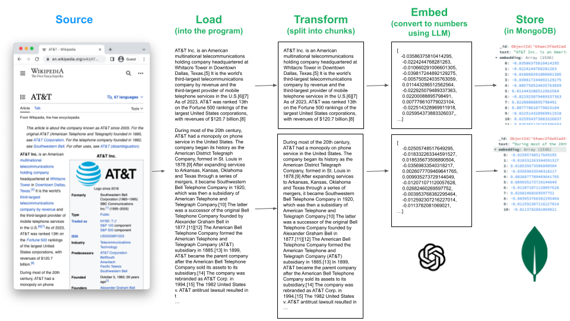
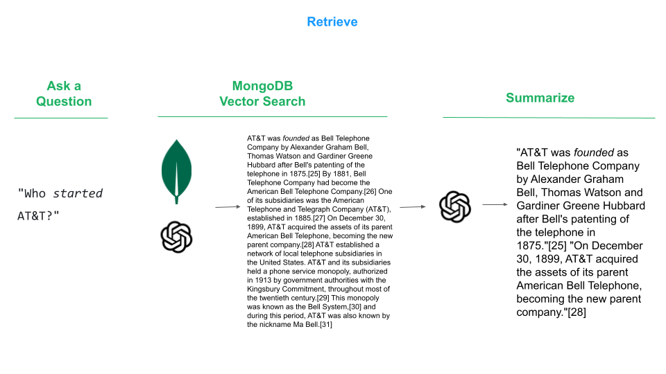
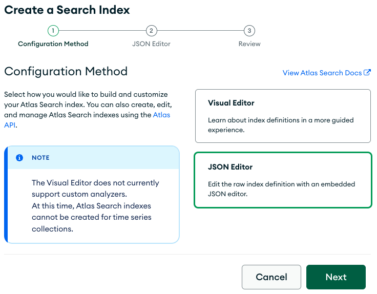
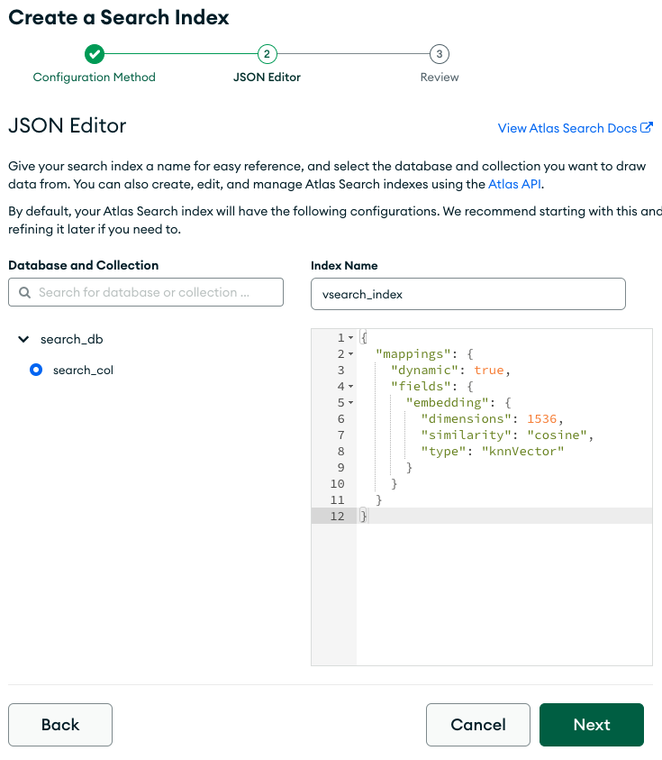

# Blackkite: Ingestor and processor of data to MongoDB

Blackkite helps you to create a small MongoDB index for makins semantic search or RAG. By default indexs only markdown files that are in a single directory.

1. Update environment variables with your MongoDB connection string and Open AI [API key](https://platform.openai.com/account/api-keys).

1. Create a new Python environment
```zsh
python3 -m venv env
```

3. Activate the new Python environment
```zsh
source env/bin/activate
```

4. Install the requirements
```zsh
pip3 install -r requirements.txt
```

5. Load, Transform, Embed and Store
```zsh
python3 vectorize.py {path}
```

Make sure all the files are in the same directory. you can use the utils to move them.
```zsh
sh move_.md.sh
```


## Semantic Search Made Easy With LangChain and MongoDB

Enabling semantic search on user-specific data is a multi-step process that includes loading, transforming, embedding and storing data before it can be queried.


That graphic is from the team over at [LangChain](https://python.langchain.com/docs/modules/data_connection/), whose goal is to provide a set of utilities to greatly simplify this process.

In this tutorial, we'll walk through each of these steps, using MongoDB Atlas as our Store. Specifically, we'll use the [AT&T Wikipedia](https://en.wikipedia.org/wiki/AT%26T) page as our data source. We'll then use libraries from LangChain to Load, Transform, Embed and Store:



Once the source is store is stored in MongoDB, we can retrieve the data that interests us:




## Prerequisites
* [MongoDB Atlas Subscription](https://cloud.mongodb.com/) (Free Tier is fine)
* Open AI [API key](https://platform.openai.com/account/api-keys)

## Quick Start Steps
1. Get the code:
```zsh
git clone https://github.com/wbleonard/atlas-langchain.git
```
2. Update [params.py](params.py) with your MongoDB connection string and Open AI [API key](https://platform.openai.com/account/api-keys).
3. Create a new Python environment
```zsh
python3 -m venv env
```
4. Activate the new Python environment
```zsh
source env/bin/activate
```

5. Install the requirements
```zsh
pip3 install -r requirements.txt
```
6. Load, Transform, Embed and Store
```zsh
python3 vectorize.py
```

7. Retrieve
```zsh
python3 query.py -q "Who started AT&T?"
```

## The Details
### Load -> Transform -> Embed -> Store
#### Step 1: Load
There's no lacking for sources of data: Slack, YouTube, Git, Excel, Reddit, Twitter, etc., and [LangChain provides a growing list](https://python.langchain.com/docs/modules/data_connection/document_loaders/) of integrations that includes this list and many more.

For this exercise, we're going to use the [WebBaseLoader](https://python.langchain.com/docs/modules/data_connection/document_loaders/integrations/web_base) to load the [Wikipedia page for AT&T](https://en.wikipedia.org/wiki/AT%26T).

```python
from langchain.document_loaders import WebBaseLoader
loader = WebBaseLoader("https://en.wikipedia.org/wiki/AT%26T")
data = loader.load()
```

 #### Step 2: Transform (Split)
 Now that we have a bunch of text loaded, it needs to be split into smaller chunks so we can tease out the relevant portion based on our search query. For this example we'll use the recommended [RecursiveCharacterTextSplitter](https://python.langchain.com/docs/modules/data_connection/document_transformers/text_splitters/recursive_text_splitter). As I have it configured, it attempts to split on paragraphs (`"\n\n"`), then sentences(`"(?<=\. )"`), then words (`" "`) using a chunk size of 1000 characters. So if a paragraph doesn't fit into 1000 characters, it will truncate at the next word it can fit to keep the chunk size under 1000 chacters. You can tune the `chunk_size` to your liking. Smaller numbers will lead to more documents, and vice-versa.

```python
from langchain.text_splitter import RecursiveCharacterTextSplitter
text_splitter = RecursiveCharacterTextSplitter(chunk_size=1000, chunk_overlap=0, separators=[
                                               "\n\n", "\n", "(?<=\. )", " "], length_function=len)
docs = text_splitter.split_documents(data)
```

#### Step 3: Embed
[Embedding](https://python.langchain.com/docs/modules/data_connection/text_embedding/) is where you associate your text with an LLM to create a vector representation of that text. There are many options to choose from, such as [OpenAI](https://openai.com/}) and [Hugging Face](https://huggingface.co/), and LangChang provides a standard interface for interacting with all of them.

For this exercise we're going to use the popular [OpenAI embedding](https://python.langchain.com/docs/modules/data_connection/text_embedding/integrations/openai). Before proceeding, you'll need an [API key](https://platform.openai.com/account/api-keys) for the OpenAI platform, which you will set in [params.py](params.py).

We're simply going to load the embedder in this step. The real power comes when we store the embeddings in Step 4.

```python
from langchain.embeddings.openai import OpenAIEmbeddings
embeddings = OpenAIEmbeddings(openai_api_key=params.openai_api_key)
```

#### Step 4: Store
You'll need a vector database to store the embeddings, and lucky for you MongoDB fits that bill. Even luckier for you, the folks at LangChain have a [MongoDB Atlas module](https://python.langchain.com/docs/modules/data_connection/vectorstores/integrations/mongodb_atlas)  that will do all the heavy lifting for you! Don't forget to add your MongoDB Atlas connection string to [params.py](params.py).

```python
from pymongo import MongoClient
from langchain.vectorstores import MongoDBAtlasVectorSearch

client = MongoClient(params.mongodb_conn_string)
collection = client[params.db_name][params.collection_name]

# Insert the documents in MongoDB Atlas with their embedding
docsearch = MongoDBAtlasVectorSearch.from_documents(
    docs, embeddings, collection=collection, index_name=index_name
)
```

You'll find the complete script in [vectorize.py](vectorize.py), which needs to be run once per data source (and you could easily modify the code to iterate over multiple data sources).

```zsh
python3 vectorize.py
```

#### Step 5: Index the Vector Embeddings
The final step before we can query the data is to create a [search index on the stored embeddings](https://www.mongodb.com/docs/atlas/atlas-search/field-types/knn-vector/).

In the Atlas console, create a Search Index using the JSON Editor named `vsearch_index` with the following definition:
```JSON
{
  "mappings": {
    "dynamic": true,
    "fields": {
      "embedding": {
        "dimensions": 1536,
        "similarity": "cosine",
        "type": "knnVector"
      }
    }
  }
}
```






### Retrieve
We could now run a search, using methods like [similirity_search](https://api.python.langchain.com/en/latest/vectorstores/langchain.vectorstores.mongodb_atlas.MongoDBAtlasVectorSearch.html?highlight=atlas#langchain.vectorstores.mongodb_atlas.MongoDBAtlasVectorSearch.similarity_search) or [max_marginal_relevance_search](https://api.python.langchain.com/en/latest/vectorstores/langchain.vectorstores.mongodb_atlas.MongoDBAtlasVectorSearch.html?highlight=atlas#langchain.vectorstores.mongodb_atlas.MongoDBAtlasVectorSearch.max_marginal_relevance_search) and that would return the relevant slice of data, which in our case would be an entire paragraph. However, we can continue to harness the power of the LLM to [contextually compress](https://python.langchain.com/docs/modules/data_connection/retrievers/how_to/contextual_compression/) the response so that it more directly tries to answer our question.

```python
from pymongo import MongoClient
from langchain.vectorstores import MongoDBAtlasVectorSearch
from langchain.embeddings.openai import OpenAIEmbeddings
from langchain.llms import OpenAI
from langchain.retrievers import ContextualCompressionRetriever
from langchain.retrievers.document_compressors import LLMChainExtractor

client = MongoClient(params.mongodb_conn_string)
collection = client[params.db_name][params.collection_name]

vectorStore = MongoDBAtlasVectorSearch(
    collection, OpenAIEmbeddings(openai_api_key=params.openai_api_key), index_name=params.index_name
)

llm = OpenAI(openai_api_key=params.openai_api_key, temperature=0)
compressor = LLMChainExtractor.from_llm(llm)

compression_retriever = ContextualCompressionRetriever(
    base_compressor=compressor,
    base_retriever=vectorStore.as_retriever()
)
```

```zsh
python3 query.py -q "Who started AT&T?"

Your question:
-------------
Who started AT&T?

AI Response:
-----------
AT&T - Wikipedia
"AT&T was founded as Bell Telephone Company by Alexander Graham Bell, Thomas Watson and Gardiner Greene Hubbard after Bell's patenting of the telephone in 1875."[25] "On December 30, 1899, AT&T acquired the assets of its parent American Bell Telephone, becoming the new parent company."[28]
```

## Resources
* [MongoDB Atlas](https://cloud.mongodb.com/)
* [Open AI API key](https://platform.openai.com/account/api-keys)
* [LangChain](https://python.langchain.com)
  * [WebBaseLoader](https://python.langchain.com/docs/modules/data_connection/document_loaders/integrations/web_base)
  * [RecursiveCharacterTextSplitter](https://python.langchain.com/docs/modules/data_connection/document_transformers/text_splitters/recursive_text_splitter)
  * [MongoDB Atlas module](https://python.langchain.com/docs/modules/data_connection/vectorstores/integrations/mongodb_atlas)
  * [Contextual Compression. ](https://python.langchain.com/docs/modules/data_connection/retrievers/how_to/contextual_compression/)
  * [MongoDBAtlasVectorSearch API](https://api.python.langchain.com/en/latest/vectorstores/langchain.vectorstores.mongodb_atlas.MongoDBAtlasVectorSearch.html)
